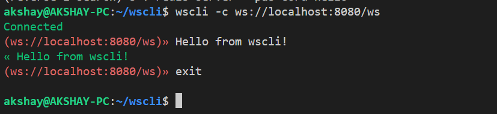
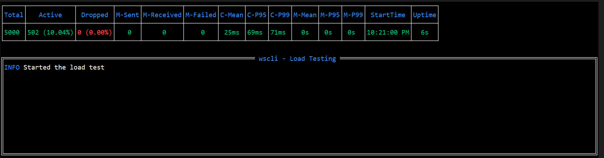
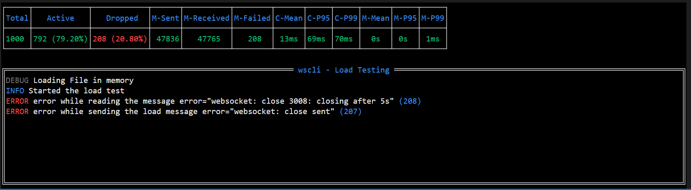
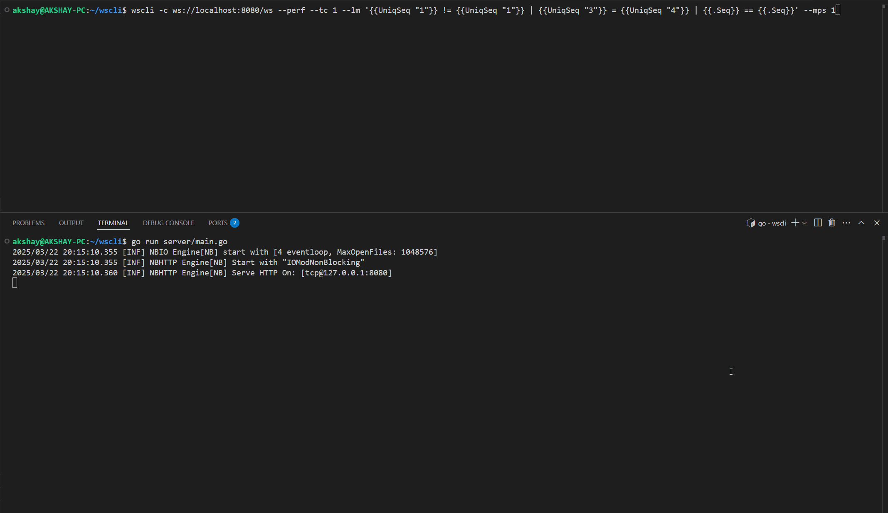

# wscli

A lightweight and powerful Go command-line tool for interacting with WebSocket servers. Designed for testing, debugging, and scripting, `wscli` provides functionality similar to `wscat` but with additional features. Supports quick load testing.

## 🚀 Installation

### Using `Docker`
```sh
$ docker run -it akshaykhairmode/wscli:latest -c "ws://example.com/ws"
```

### Using `go install`
```sh
go install github.com/akshaykhairmode/wscli@latest
```

### Using `homebrew`
```sh
brew tap akshaykhairmode/tools
brew install akshaykhairmode/tools/wscli
```

### Download Prebuilt Binaries
If you don’t have Go installed, download the latest binaries from the [Releases Page](https://github.com/akshaykhairmode/wscli/releases).

## 🔧 Usage

### Connect to a WebSocket server
```sh
$ wscli -c ws://localhost:8080/ws
```

### Connect to a Unix domain socket

```sh
$ wscli -c ws://localhost/ws --unix-socket /tmp/ws.sock 
NOTE : The -c command is required which actually tells the path to the websocket
```

### Connect with custom headers
```sh
$ wscli -c ws://localhost:8080/ws -H "Authorization: Bearer mytoken" -H "X-Custom: value"
```

### Send a command immediately after connecting
```sh
$ wscli -c ws://localhost:8080/ws -x '{"action": "subscribe", "channel": "updates"}'
```

### Send a close message with code 1000 and reason "normal closure"
```sh
$ wscli --slash -c ws://localhost:8080/ws
/close 1000 normal closure
```

### Send a binary file
```sh
$ wscli --slash -c ws://localhost:8080/ws
/bfile /home/user/test.bin
```

## ✨ Features

- **🔹 Native Binaries:** Easy installation across systems.
- **📤 Piped Input:** Send piped input using `|` (disables interactive terminal features).
- **📨 Multiple Messages on Connect:** Send multiple messages immediately after connecting.
- **🎭 Background Execution:**
  - Run `wscli` in the background using `nohup`:
    ```sh
    $ nohup wscli -c ws://localhost/ws -w 1s > nohup.out 2>&1 &
    ```
  - Redirect output and run in the background:
    ```sh
    $ wscli -c ws://localhost/ws >> output.txt & 2>&1
    ```
- **📜 History Persistence:** Maintain a command history for quick reuse.
- **⚡ Command Execution on Connect:** Use `-x` to execute commands automatically.
- **📌 JSON Pretty Printing:** Format JSON responses using `--jspp`.
- **⌨️ Terminal Shortcuts:** Supports readline shortcuts like `Ctrl+W` (delete word) and `Ctrl+R` (reverse search). [See full list](https://github.com/chzyer/readline/blob/master/doc/shortcut.md).
- **🗂️ Binary File Transfer:** Send a file as a binary message.
- **📊 Load Testing:** Perform load tests using the `--perf` flag.

## 🛠 Available Flags

| Flag | Shorthand | Description |
|------|----------|-------------|
| `--auth` | | HTTP Basic Authentication (`username:password`). |
| `--bind-address` | | Bind address for outgoing connection (e.g., 192.168.1.100). |
| `--binary` | `-b` | Send hex-encoded data. |
| `--ca` | | Path to the CA certificate file (optional). |
| `--cert` | | Path to the client certificate file (optional). |
| `--connect` | `-c` | WebSocket connection URL. |
| `--execute` | `-x` | Execute a command after connecting. |
| `--gzipr` | | Enable gzip decoding (server must send messages as binary). |
| `--header` | `-H` | Custom headers (`key:value`). |
| `--help` | `-h` | Show help information. |
| `--ip-version` | | IP version to use for outgoing connection (4 or 6). |
| `--jspp` | | Enable JSON pretty printing. |
| `--key` | | Path to the certificate key file (optional). |
| `--no-check` | `-n` | Disable TLS certificate verification. |
| `--no-color` | | Disable colored output. |
| `--origin` | `-o` | Specify origin for the WebSocket connection. |
| `--proxy` | | Use a proxy URL. |
| `--unix-socket` | | Connect to a Unix domain socket. |
| `--response` | `-r` | Show HTTP response headers. |
| `--show-ping-pong` | `-P` | Show ping/pong messages. |
| `--slash` | | Enable slash commands. |
| `--sub-protocol` | `-s` | Specify a WebSocket sub-protocol. |
| `--verbose` | `-v` | Enable debug logging. |
| `--version` | `-V` | Show version information. |
| `--wait` | `-w` | Wait time after execution (`1s`, `1m`, `1h`). |
| `--print-interval` | | The interval for printing the output. Default is 1s. |
| `--ping-interval` | | The interval for pinging to the connected server. Default is 30s. |
| `--perf` | | Enable performance testing. |
| `--std-out` | | Print the received messages in standard output, default is standard error. |


## 🛠 Slash Commands (Enable via `--slash`)

| Command | Description |
|---------|-------------|
| `/flags` | Show loaded flags. |
| `/ping` | Send a ping message. |
| `/pong` | Send a pong message. |
| `/close` | Send a close message (`/close <code> <reason>`). |
| `/bfile` | Send a file (`/bfile <file_path>`). Max size: 50MB. |

## 📊 Load Testing (Enable via `--perf`)

| Flag | Description | Data Type |
|------|-------------|-----------|
| `--tc` | Total number of connections. | unsigned integer |
| `--lm` | Load message to send. Can use templates defined below. File input supported. | string |
| `--am` | Authentication message. Can use templates defined below. File input supported. | string |
| `--mi` | Message interval. (default: 0s). If not set, then lm will be sent only once. | duration |
| `--waa` | Wait time after authentication before sending load messages. | duration |
| `--wba` | Wait time before sending auth message to the server | duration |
| `--rups` | Connections ramp-up per second (default: 1). | unsigned integer |
| `--outfile` | Do not open the tview output and write the output to file. | string |
| `--srp` | Percentage of connections that will be slow readers. | unsigned integer |
| `--srd` | Duration by which slow readers will delay reading messages. Default 100ms if srp is greater than 0. | duration |
| `--pconfig` | Take perf config from file. Pass the file path here. The format of the file is available [here](config.yaml). This will override all other perf flags even if set. | string |

**Note**: `--lm` and `--am` also support file input. Provide an absolute path to send messages from a file. The file reading will restart from the first line when EOF is reached. If file is less than 10MB then we store it in memory. "\n" is the delimeter.

### Load Message Templates

| **Function**                          | **Description**                                                                                                   | **Parameters**                      | **Data Types**                  |
|---------------------------------------|------------------------------------------------------------------------------------------------------------------|------------------------------------|--------------------------------|
| `RandomNum`                           | Generates a random number between 0 and `<max>` (default range: 0–10,000).                                      | `<max>` (optional)                 | Integer                        |
| `RandomUUID`                          | Generates a random UUID.                                                                                         | None                               | N/A                            |
| `RandomAN`                            | Generates a random alphanumeric string with the specified `<length>` (default: 10 characters).                   | `<length>` (optional)              | Integer                        |
| `UniqSeq`                             | Generates a unique atomic sequence within a specified `<group>`. Multiple connections share the same sequence when using the same group. The `<start>` value sets the initial number (default: 0). If different start values are provided, the first one is used. Examples: <br> - `{{UniqSeq "1" 10}} != {{UniqSeq "1" 10}}` (Not the same number) <br> - `{{UniqSeq "0"}} == {{UniqSeq "1"}}` (Different groups generate the same number) | `<group>` <br> `<start>` (optional) | String <br> Integer            |
| `.Seq`                                | Generates a sequence starting from 0 for each connection. No shared counters.      |                |                         |
| `Array`                               | Selects an element from a list of strings sequentially. The sequence is shared globally across all connections. | `{{Array "Elem1" "Elem2" "ElemN"}}`          | String                         |
| `RandomArray`                         | Selects a random element from a list of strings.                                                                 |    `{{RandomArray "Elem1" "Elem2" "ElemN"}}`       | String                         |


#### Example
```sh
$ wscli -c ws://localhost:8080/ws --perf --tc 1000 --lm "hello world {{RandomNum 50}}" --rups 100 --mi 1s #with template

OR

$ wscli -c ws://localhost:8080/ws --perf --tc 1000 --lm "/tmp/load.txt" --rups 100 --mi 1s #with file messages

OR

$ wscli -c ws://localhost:8080/ws --pconfig "config.yaml" # pass perf config by yaml.

# Flags used:
# --perf (enable performance testing)
# --tc 1000 (create 1000 connections)
# --lm "hello world {{RandomNumber 50}}" (load message, generate a random number from 0 to 50)
# --lm "/tmp/load.txt" (load message, read from file)
# --rups 100 (ramp up 100 connections per second)
# --mi 1s (send 1 message per second)
```

**Normal Output**



**Perf output**:



**Perf Verbose output**:
 


**Demo**


