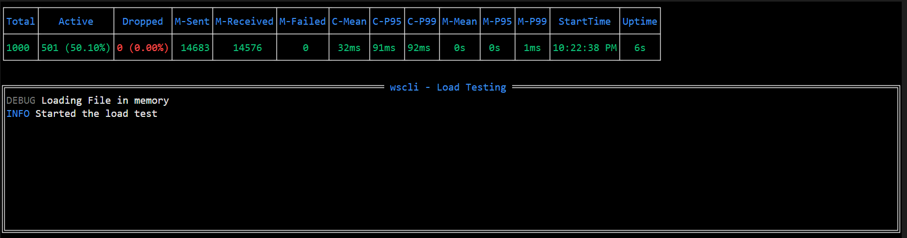

# wscli

A lightweight and powerful Go command-line tool for interacting with WebSocket servers. Designed for testing, debugging, and scripting, `wscli` provides functionality similar to `wscat` but with additional features. Supports quick load testing.

## 🚀 Installation

### Using Docker
```sh
$ docker run -it akshaykhairmode/wscli:latest -c "ws://example.com/ws"
```

### Using `go install`
```sh
go install github.com/akshaykhairmode/wscli@latest
```

### Download Prebuilt Binaries
If you don’t have Go installed, download the latest binaries from the [Releases Page](https://github.com/akshaykhairmode/wscli/releases).

## 🔧 Usage

### Connect to a WebSocket server
```sh
$ wscli -c ws://localhost:8080/ws
```

### Connect with custom headers
```sh
$ wscli -c ws://localhost:8080/ws -H "Authorization: Bearer mytoken" -H "X-Custom: value"
```

### Send a command immediately after connecting
```sh
$ wscli -c ws://localhost:8080/ws -x '{"action": "subscribe", "channel": "updates"}'
```

### Send a close message with code 1000 and reason "normal closure"
```sh
$ wscli --slash -c ws://localhost:8080/ws
/close 1000 normal closure
```

### Send a binary file
```sh
$ wscli --slash -c ws://localhost:8080/ws
/bfile /home/user/test.bin
```

## ✨ Features

- **🔹 Native Binaries:** Easy installation across systems.
- **📤 Piped Input:** Send piped input using `|` (disables interactive terminal features).
- **📨 Multiple Messages on Connect:** Send multiple messages immediately after connecting.
- **🎭 Background Execution:**
  - Run `wscli` in the background using `nohup`:
    ```sh
    $ nohup wscli -c ws://localhost/ws -w 1s > nohup.out 2>&1 &
    ```
  - Redirect output and run in the background:
    ```sh
    $ wscli -c ws://localhost/ws >> output.txt & 2>&1
    ```
- **📜 History Persistence:** Maintain a command history for quick reuse.
- **⚡ Command Execution on Connect:** Use `-x` to execute commands automatically.
- **📌 JSON Pretty Printing:** Format JSON responses using `--jspp`.
- **⌨️ Terminal Shortcuts:** Supports readline shortcuts like `Ctrl+W` (delete word) and `Ctrl+R` (reverse search). [See full list](https://github.com/chzyer/readline/blob/master/doc/shortcut.md).
- **🗂️ Binary File Transfer:** Send a file as a binary message.
- **📊 Load Testing:** Perform load tests using the `--perf` flag.

## 🛠 Available Flags

| Flag | Shorthand | Description |
|------|----------|-------------|
| `--auth` | | HTTP Basic Authentication (`username:password`). |
| `--binary` | `-b` | Send hex-encoded data. |
| `--ca` | | Path to the CA certificate file (optional). |
| `--cert` | | Path to the client certificate file (optional). |
| `--connect` | `-c` | WebSocket connection URL. |
| `--execute` | `-x` | Execute a command after connecting. |
| `--gzipr` | | Enable gzip decoding (server must send messages as binary). |
| `--header` | `-H` | Custom headers (`key:value`). |
| `--help` | `-h` | Show help information. |
| `--jspp` | | Enable JSON pretty printing. |
| `--key` | | Path to the certificate key file (optional). |
| `--no-check` | `-n` | Disable TLS certificate verification. |
| `--no-color` | | Disable colored output. |
| `--origin` | `-o` | Specify origin for the WebSocket connection. |
| `--proxy` | | Use a proxy URL. |
| `--response` | `-r` | Show HTTP response headers. |
| `--show-ping-pong` | `-P` | Show ping/pong messages. |
| `--slash` | | Enable slash commands. |
| `--sub-protocol` | `-s` | Specify a WebSocket sub-protocol. |
| `--verbose` | `-v` | Enable debug logging. |
| `--version` | `-V` | Show version information. |
| `--wait` | `-w` | Wait time after execution (`1s`, `1m`, `1h`). |
| `--print-interval` | | The interval for printing the output. Default is 1s. |
| `--ping-interval` | | The interval for pinging to the connected server. Default is 30s. |
| `--perf` | | Enable performance testing. |

## 🛠 Slash Commands (Enable via `--slash`)

| Command | Description |
|---------|-------------|
| `/flags` | Show loaded flags. |
| `/ping` | Send a ping message. |
| `/pong` | Send a pong message. |
| `/close` | Send a close message (`/close <code> <reason>`). |
| `/bfile` | Send a file (`/bfile <file_path>`). Max size: 50MB. |

## 📊 Load Testing (Enable via `--perf`)

| Flag | Description |
|------|-------------|
| `--tc` | Total number of connections. |
| `--lm` | Load message to send. Can use templates defined below. File input supported. |
| `--mps` | Messages per second (default: 1). |
| `--am` | Authentication message. Can use templates defined below. File input supported. |
| `--waa` | Wait time after authentication before sending load messages. |
| `--rups` | Connections ramp-up per second (default: 1). |
| `--outfile` | Do not open the tview output and write the output to file. |

**Note**: `--lm` and `--am` also support file input. Provide an absolute path to send messages from a file. The file reading will restart from the first line when EOF is reached. If file is less than 10MB then we store it in memory. "\n" is the delimeter.

### Load Message Templates

| Function | Description |
|----------|-------------|
| `RandomNumber <max>` | Generates a random number (default: 0–10,000). |
| `RandomUUID` | Generates a random UUID. |
| `RandomAlphaNumeric <length>` | Generates a random alphanumeric string (default length: 10). |

#### Example
```sh
$ wscli -c ws://localhost:8080/ws --perf --tc 1000 --lm "hello world {{RandomNumber 50}}" --rups 100 --mps 10

OR

$ wscli -c ws://localhost:8080/ws --perf --tc 1000 --lm "/tmp/load.txt" --rups 100 --mps 10

# Flags used:
# --perf (enable performance testing)
# --tc 1000 (create 1000 connections)
# --lm "hello world {{RandomNumber 50}}" (load message, generate a random number from 0 to 50)
# --lm "/tmp/load.txt" (load message, read from file)
# --rups 100 (ramp up 100 connections per second)
# --mps 10 (send 10 messages per second)
```

**output**:


Output with `-v`
 


## 🚧 Upcoming Features

- **WebSocket Listener:** Implement a feature to start a WebSocket server.